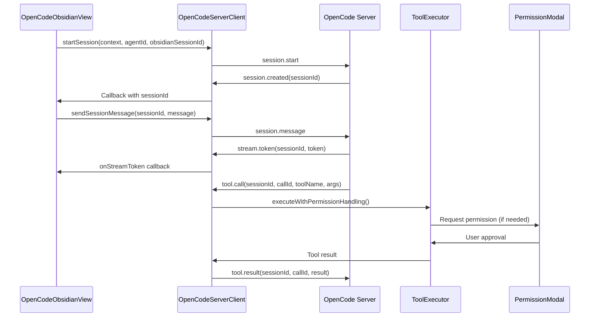

# Architecture Decision Records

This document describes the architecture and key design decisions for the OpenCode Obsidian plugin.

## Table of Contents

-   [Overview](#overview)
-   [Core Architecture](#core-architecture)
-   [OpenCode Server Integration](#opencode-server-integration)
-   [Key Design Decisions](#key-design-decisions)
-   [Module Responsibilities](#module-responsibilities)
-   [Data Flow](#data-flow)
-   [Known Issues and Improvement Plans](#known-issues-and-improvement-plans)

## Related Documentation

-   [Agent Design Document](./AGENT-DESIGN.md) - Detailed design for the Agent system
-   [Agents User Guide](./AGENTS.md) - User-facing documentation for creating and using agents

## Overview

The OpenCode Obsidian plugin is built with a modular architecture that separates concerns into distinct modules. The plugin follows TypeScript best practices with strong typing, dependency injection, and clear separation of responsibilities.

## Core Architecture

### Plugin Entry Point

**File**: `src/main.ts`

The `OpenCodeObsidianPlugin` class extends Obsidian's `Plugin` class and serves as the main entry point. It orchestrates:

-   Plugin lifecycle management
-   Settings loading and saving
-   Component initialization (ProviderManager, ConfigLoader, HookRegistry, AgentResolver)
-   View registration
-   Command registration

### Core Modules

#### 1. Error Handling (`src/utils/error-handler.ts`)

**Responsibility**: Unified error handling across the application

-   **ErrorHandler**: Centralized error handling system
    -   Consistent error logging
    -   User notification with severity levels
    -   Error collection for reporting
    -   Function wrapping for automatic error handling

**Key Features**:

-   Severity levels (Critical, Error, Warning, Info)
-   Context-aware error messages
-   Configurable notification callbacks
-   Optional error collection for debugging

#### 2. Input Validation (`src/utils/validators.ts`)

**Responsibility**: Validate configuration, agent, and provider inputs

-   Comprehensive validation functions for:
    -   OpenCodeConfig
    -   Provider configurations
    -   Agent frontmatter and structures
    -   Skill frontmatter and structures

**Key Features**:

-   Type-safe validation with detailed error messages
-   URL format validation
-   Color hex validation
-   Model format validation
-   Provider ID format validation

#### 3. OpenCode Server Client (`src/opencode-server/client.ts`)

**Responsibility**: HTTP + SSE communication with OpenCode Server runtime

-   **OpenCodeServerClient**: Obsidian wrapper for `@opencode-ai/sdk/client`
    -   Session management (create, get, abort)
    -   Message sending with streaming support
    -   SSE event stream handling with auto-reconnect
    -   Obsidian `requestUrl` API adapter for custom fetch
    -   Event callback system for UI integration

**Key Features**:

-   Based on official `@opencode-ai/sdk/client` SDK
-   Non-blocking `connect()` - starts SSE loop in background
-   Automatic reconnection with exponential backoff
-   Local session caching to reduce server requests
-   Support for both Node.js and SDK event streams
-   Comprehensive error handling with user-friendly messages

**API Methods**:

-   Connection: `connect()`, `disconnect()`, `getConnectionState()`, `isConnected()`
-   Sessions: `createSession()`, `startSession()`, `ensureSession()`, `abortSession()`
-   Messages: `sendMessage()`, `sendSessionMessage()`
-   Events: `onStreamToken()`, `onStreamThinking()`, `onError()`, `onProgressUpdate()`, `onSessionEnd()`
-   Health: `healthCheck()`

#### 4. Obsidian Tool System (`src/tools/obsidian/`)

**Responsibility**: Tool execution, permission management, and audit logging

-   **ObsidianToolRegistry**: Tool registration and routing
    -   Registers core Obsidian tools
    -   Validates tool input schemas using Zod
    -   Routes tool calls to appropriate executor
-   **ObsidianToolExecutor**: Tool execution with permission checks
    -   Executes tool operations (read/write/create/update)
    -   Checks permissions using PermissionManager
    -   Records audit logs via AuditLogger
    -   Handles permission requests via PermissionModal
-   **PermissionManager**: Permission management
    -   Three-level permission model (read-only, scoped-write, full-write)
    -   Path-based permission scopes (allowed/denied patterns)
    -   File size and extension validation
-   **AuditLogger**: Audit logging for all tool operations
    -   Logs all tool executions with timestamps
    -   Records permission decisions
    -   Stores logs in `.opencode/audit/` directory

**Key Features**:

-   6 core Obsidian tools (search_vault, read_note, list_notes, get_note_metadata, create_note, update_note)
-   Permission-based tool execution with user approval for write operations
-   Comprehensive audit logging for security and debugging
-   Type-safe tool input validation with Zod schemas

**Available Tools**:

1. `obsidian.search_vault` - Search notes in vault (read-only)
2. `obsidian.read_note` - Read note content (read-only)
3. `obsidian.list_notes` - List notes in folder (read-only)
4. `obsidian.get_note_metadata` - Get note metadata including frontmatter, tags, links (read-only)
5. `obsidian.create_note` - Create new note (scoped-write)
6. `obsidian.update_note` - Update note content with multiple modes (scoped-write)
    - `replace`: Replace entire content
    - `append`: Append to end
    - `prepend`: Prepend to beginning
    - `insert`: Insert at line number or marker

## OpenCode Server Integration

The plugin integrates with OpenCode Server via HTTP + SSE for agent orchestration and tool execution.

### Architecture Overview

```
┌─────────────────────┐      HTTP + SSE         ┌──────────────────┐
│  Obsidian Plugin    │ <────────────────────────> │  OpenCode Server │
│  (Client)           │   API Requests + Events │   (Runtime)      │
└─────────────────────┘                            └──────────────────┘
         │                                                   │
         │                                                   │
    ┌────┴────┐                                    ┌────────┴────────┐
    │  View   │                                    │   Agent Loop    │
    │Session  │                                    │  Tool Execution │
    └─────────┘                                    └─────────────────┘
```

### Communication Flow

1. **Session Start**: View sends `session.start` → Server responds with `session.created`
2. **Message Exchange**: View sends `session.message` → Server streams tokens via `stream.token`
3. **Tool Execution**: Server sends `tool.call` → Plugin executes via ToolExecutor → Returns `tool.result`
4. **Permission Requests**: Server sends `permission.request` → User approves via Modal → Returns `permission.response`
5. **Session End**: Server sends `session.end` when task completes or errors

### Protocol Implementation

**File**: `src/opencode-server/client.ts`

-   HTTP API client for sending messages
-   SSE event handler for receiving streaming updates
-   Type-safe event handling
-   Session ID management

**Current Architecture Issues**:

⚠️ **Issue 1**: View directly binds SSE callbacks

-   `OpenCodeObsidianView` registers callbacks directly on `OpenCodeServerClient`
-   UI layer knows transport protocol details (stream.token, thinking, progress)
-   Makes it difficult to replace protocol or introduce offline mode
-   **Solution**: Introduce SessionEventBus to decouple UI from transport layer

⚠️ **Issue 2**: Concurrent session callbacks conflict

-   `startSession()` uses array for callbacks, causing race conditions
-   Multiple concurrent `startSession()` calls may receive wrong `sessionId`
-   Timeout cleanup not properly handled, causing memory leaks
-   **Solution**: Use `Map<obsidianSessionId, PendingRequest>` for request tracking

⚠️ **Issue 3**: Stream callbacks ignore sessionId

-   All stream callbacks use `activeConv` instead of checking `sessionId`
-   Multi-session scenarios cause messages to be written to wrong conversation
-   **Solution**: Route messages by `sessionId` using `findConversationBySessionId()`

### Connection Management

**Current State**:

-   Connection initialized in `main.ts` plugin initialization
-   View's `onOpen()` also checks and connects if needed
-   No unified connection state management

**Planned Improvement**:

-   Create `ConnectionManager` to centralize connection lifecycle
-   Plugin manages connection, View only displays state
-   Clear separation of concerns

## Key Design Decisions

### ADR-1: Unified Error Handling System

**Decision**: Implement a centralized ErrorHandler class instead of scattered console.error calls

**Rationale**:

-   Consistent error reporting across the application
-   Easier to change error handling behavior globally
-   Better user experience with contextual error messages
-   Enables error collection for debugging

**Implementation**: `src/utils/error-handler.ts`

### ADR-2: Incremental DOM Updates

**Decision**: Replace full re-renders with incremental DOM updates

**Rationale**:

-   Better performance (reduces unnecessary DOM operations)
-   Smoother user experience
-   Only update changed parts of UI
-   Reduces flickering and layout shifts

**Implementation**: `src/opencode-obsidian-view.ts`

### ADR-3: Debounce and Throttle Utilities

**Decision**: Implement custom debounce/throttle utilities instead of using lodash

**Rationale**:

-   No external dependencies
-   TypeScript-native with proper typing
-   Supports both sync and async functions
-   Sufficient for use cases (input field saving, model fetching)

**Implementation**: `src/utils/debounce-throttle.ts`

### ADR-4: Configuration Constants File

**Decision**: Extract all magic numbers to a central constants file

**Rationale**:

-   Single source of truth for configuration values
-   Easier to adjust thresholds and limits
-   Self-documenting code
-   Better maintainability

**Implementation**: `src/utils/constants.ts`

### ADR-5: HTTP + SSE Protocol for OpenCode Server

**Decision**: Use HTTP + SSE for OpenCode Server communication

**Rationale**:

-   Real-time bidirectional communication required for agent orchestration
-   HTTP API for client-to-server (session/message operations)
-   SSE for server-to-client streaming (tokens, thinking, status)
-   Enables tool call coordination and permission requests
-   Better browser compatibility than WebSocket

**Implementation**: `src/opencode-server/client.ts`

**Status**: ✅ Implemented, but needs improvements (see Known Issues)

### ADR-6: Permission System for Tool Execution

**Decision**: Implement permission-based tool execution with user approval for write operations

**Rationale**:

-   Security: Prevents unauthorized file modifications
-   User control: Users can review changes before applying
-   Audit trail: All tool operations are logged
-   Flexibility: Supports read-only, scoped-write, and full-write modes

**Implementation**: `src/tools/obsidian/permission-manager.ts`, `tool-executor.ts`

**Status**: ✅ Implemented (preview generation is permission-checked via `ObsidianToolExecutor.generatePreview`)

## Module Responsibilities

### Main Plugin (`src/main.ts`)

-   Plugin lifecycle (onload, onunload)
-   Settings management
-   Component orchestration
-   Command registration

### View Component (`src/opencode-obsidian-view.ts`)

-   UI rendering and updates
-   User interaction handling
-   Conversation management
-   Incremental DOM updates

### OpenCode Server Client (`src/opencode-server/client.ts`)

-   HTTP + SSE communication with OpenCode Server using `@opencode-ai/sdk/client`
-   Session lifecycle management (start, message, abort)
-   Stream token/thinking/progress handling via SSE
-   Tool call coordination with Obsidian tools
-   Permission modal integration for write operations

### Session Layer (`src/session/`)

-   `SessionEventBus`: decouples UI from transport callbacks
-   `ConnectionManager`: centralized connect/reconnect lifecycle and diagnostics

### Error Handler (`src/utils/error-handler.ts`)

-   Unified error handling with severity levels
-   User notifications with context-aware messages
-   Error collection for debugging
-   Function wrapping for automatic error handling

### Validators (`src/utils/validators.ts`)

-   Type-safe input validation for configs, agents, providers
-   URL format validation and security checks
-   Color hex validation and model format validation
-   Provider ID format validation

### Constants (`src/utils/constants.ts`)

-   Configuration constants and threshold values
-   Size limits and time intervals
-   Centralized configuration for maintainability

### Obsidian Tool System (`src/tools/obsidian/`)

-   Tool definitions and schemas (Zod validation)
-   Tool execution with permission checks
-   Audit logging for all tool operations
-   Permission management (read-only, scoped-write, full-write)
-   Tool registry and routing

**Available Tools (6 core tools)**:

1. `obsidian.search_vault` - Search notes in vault (read-only)
2. `obsidian.read_note` - Read note content (read-only)
3. `obsidian.list_notes` - List notes in folder (read-only)
4. `obsidian.get_note_metadata` - Get note metadata including frontmatter, tags, links (read-only)
5. `obsidian.create_note` - Create new note (scoped-write)
6. `obsidian.update_note` - Update note content with multiple modes (scoped-write)
    - `replace`: Replace entire content
    - `append`: Append to end
    - `prepend`: Prepend to beginning
    - `insert`: Insert at line number or marker

**Permission System**:

-   Read-only operations: No approval required
-   Scoped-write operations: Require user approval via PermissionModal
-   Permission scopes: Allowed/denied paths, file size limits, extension filters
-   Audit logging: All tool executions are logged with timestamps and metadata

## Data Flow

### OpenCode Server Message Flow (Current)



**Issues with Current Flow**:

-   ⚠️ Direct callback binding (no event bus)
-   ⚠️ No sessionId validation in stream callbacks
-   ⚠️ Concurrent session requests can conflict

### Error Handling Flow

1. Error occurs in any module
2. Module calls `ErrorHandler.handleError()` with:
    - Error instance
    - Context (module, function, operation, metadata)
    - Severity level
3. ErrorHandler:
    - Logs to console (if enabled)
    - Collects error (if enabled)
    - Shows user notification (if enabled and severity warrants)
4. Error is handled gracefully, user sees friendly message

## Tool System

### Tool Execution Flow

1. OpenCode Server sends tool call request via HTTP API
2. `OpenCodeServerClient` receives SSE event and calls `ObsidianToolRegistry`
3. `ObsidianToolRegistry` validates input schema and routes to `ObsidianToolExecutor`
4. `ObsidianToolExecutor` executes tool operation:
    - Checks permissions using `PermissionManager.canRead()` / `canWrite()`
    - Performs operation (read/write/create/update)
    - Records audit log via `AuditLogger`
    - Returns result or throws `PermissionPendingError` if approval needed
5. If approval required:
    - `generatePreview()` called (currently in `OpenCodeServerClient` - ⚠️ bypasses permissions)
    - `PermissionModal` is shown to user with preview
    - User approves or denies operation
6. Result sent back to OpenCode Server via HTTP API

**Current Issues**:

-   ⚠️ Preview generation (`generatePreview`) in `OpenCodeServerClient` directly reads files, bypassing `PermissionManager`
-   ⚠️ Preview and execution use different code paths, inconsistent permission checks

**Planned Improvement**:

-   Move `generatePreview()` to `ObsidianToolExecutor`
-   Unified permission check path for both preview and execution
-   Consistent audit logging for preview operations

### Permission Model

**Permission Levels**:

-   `read-only`: Can only read vault files
-   `scoped-write`: Can write to specific paths (requires approval)
-   `full-write`: Can write anywhere (requires approval)

**Permission Scope**:

-   `allowedPaths`: Glob patterns for allowed file paths
-   `deniedPaths`: Glob patterns for denied file paths (checked first)
-   `maxFileSize`: Maximum file size in bytes
-   `allowedExtensions`: List of allowed file extensions

**Update Note Tool**:
The `update_note` tool supports four update modes for markdown editing:

-   `replace`: Completely replace file content (useful for full rewrites)
-   `append`: Add content to end of file (useful for logging, notes)
-   `prepend`: Add content to beginning of file (useful for headers, metadata)
-   `insert`: Insert at specific line number or after marker string (most precise control)

All write operations default to `dryRun=true` to show preview before applying.

## Testing Strategy

-   **Unit Tests**: Core business logic (ErrorHandler, AgentResolver, ToolExecutor, PermissionManager) - using Vitest
-   **Integration Tests**: Configuration loading and validation, tool execution flow
-   **E2E Tests**: Not implemented (would require Obsidian environment)

## Known Issues and Improvement Plans

### Critical Issues (Recently Addressed)

#### 1. HTTP Client SDK Migration ✅ COMPLETED

**Issue**: Custom HTTP client implementation with scattered fetch calls and inconsistent error handling.

**Solution**: Migrated to `@opencode-ai/sdk/client` for standardized API interactions.

-   Unified HTTP client wrapper with consistent error handling
-   Standardized request/response patterns
-   Improved type safety and maintainability

**Files**: `src/opencode-server/client.ts`

#### 2. Task Orchestration Enhancement (planned)

**Issue**: TodoManager was only a data storage system without orchestration capabilities.

**Status**: Not implemented in this repository snapshot.

#### 3. MCP Integration (planned)

**Issue**: MCP integration was placeholder implementation.

**Status**: Not implemented in this repository snapshot.

**Files**: N/A

### Architecture Improvements (Medium Priority)

#### 4. Session/Event Bus for Decoupling ✅ IMPLEMENTED

**Issue**: View directly binds SSE callbacks, UI knows transport protocol details.

**Impact**: Difficult to replace protocol or introduce offline mode.

**Solution**:

-   Create `SessionEventBus` class (`src/session/session-event-bus.ts`)
-   Convert SSE events to domain events (TokenReceived, ToolCallRequested, etc.)
-   View subscribes to domain events, not SSE callbacks
-   Enables protocol abstraction and offline mode support

**Files**: New `src/session/session-event-bus.ts`, `src/opencode-server/client.ts`, `src/opencode-obsidian-view.ts`

#### 5. Unified Connection Management ✅ IMPLEMENTED

**Issue**: Connection management split between `main.ts` and `OpenCodeObsidianView.onOpen()`.

**Impact**: Unclear ownership, connection state not centrally managed.

**Solution**:

-   Create `ConnectionManager` class
-   Plugin initializes and manages connection lifecycle
-   View only displays state and triggers user actions (connect/disconnect buttons)
-   Expose connection state via events or observable

**Files**: New `src/session/connection-manager.ts`, `src/main.ts`, `src/opencode-obsidian-view.ts`

#### 6. Preview Generation Permission Check

**Issue**: Preview generation and execution paths can drift, leading to inconsistent permission checks.

**Impact**: Preview and execution use different code paths, inconsistent permission checks.

**Solution** (current):

-   Keep preview generation in `ObsidianToolExecutor.generatePreview()`
-   Unified permission check path for both preview and execution
-   Consistent audit logging for preview operations

**Files**: `src/tools/obsidian/tool-executor.ts`, `src/tools/obsidian/tool-registry.ts`

## Future Considerations

-   **Event-Driven Architecture**: Complete migration to event bus pattern for better decoupling
-   **Protocol Abstraction**: Support multiple protocols (HTTP/SSE, WebSocket, local inference)
-   **Offline Mode**: Support local LLM inference without server dependency
-   **Enhanced Caching**: Multi-level caching for tool results
-   **Performance Monitoring**: Metrics collection and performance dashboards
