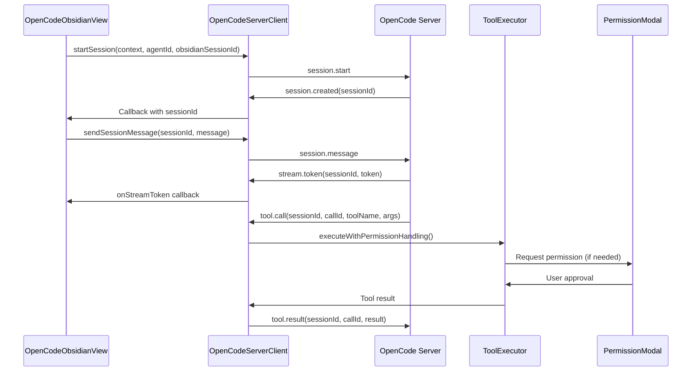
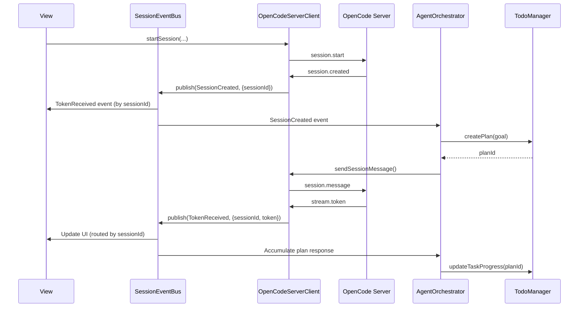

# Architecture Decision Records

This document describes the architecture and key design decisions for the OpenCode Obsidian plugin.

## Table of Contents

- [Overview](#overview)
- [Core Architecture](#core-architecture)
- [OpenCode Server Integration](#opencode-server-integration)
- [Key Design Decisions](#key-design-decisions)
- [Module Responsibilities](#module-responsibilities)
- [Data Flow](#data-flow)
- [Known Issues and Improvement Plans](#known-issues-and-improvement-plans)

## Overview

The OpenCode Obsidian plugin is built with a modular architecture that separates concerns into distinct modules. The plugin follows TypeScript best practices with strong typing, dependency injection, and clear separation of responsibilities.

## Core Architecture

### Plugin Entry Point

**File**: `src/main.ts`

The `OpenCodeObsidianPlugin` class extends Obsidian's `Plugin` class and serves as the main entry point. It orchestrates:

- Plugin lifecycle management
- Settings loading and saving
- Component initialization (ProviderManager, ConfigLoader, HookRegistry, AgentResolver)
- View registration
- Command registration

### Core Modules

#### 1. Provider Management (`src/provider-manager.ts`)

**Responsibility**: Manage AI provider clients and model fetching

- **ProviderManager**: Centralized management of multiple AI providers
  - Client initialization and caching
  - Model fetching with throttling and caching
  - Provider switching
  - Factory method for client creation (eliminates duplication)

**Key Features**:
- LRU-based model list caching (30s duration)
- Throttling for model fetching (2s minimum interval)
- Support for built-in providers (Anthropic, OpenAI, Google, ZenMux) and compatible providers

#### 2. AI Client (`src/embedded-ai-client.ts`)

**Responsibility**: Direct interaction with AI provider APIs

- **EmbeddedAIClient**: Unified client interface for all AI providers
  - Streaming response handling
  - Session management with LRU cache
  - Type-safe event handling for Anthropic SDK
  - Support for multiple providers via unified interface

**Key Features**:
- LRU session cache (max 50 sessions, 30min idle timeout)
- Periodic cleanup of inactive sessions (5min interval)
- Type-safe Anthropic stream event handling
- Modular event handlers for maintainability

#### 3. Agent Resolution (`src/agent/agent-resolver.ts`)

**Responsibility**: Resolve and merge agent configurations

- **AgentResolver**: Encapsulates agent lookup, skill merging, and instruction integration
  - Agent configuration lookup
  - Skill merging into prompts
  - Instruction integration from config loader
  - Model and tool override handling

**Key Features**:
- Clean separation of agent resolution logic
- Skill merging with formatted sections
- Instruction integration from cached config loader

#### 4. Configuration Loading (`src/config-loader.ts`)

**Responsibility**: Load and parse configuration files from vault

- **ConfigLoader**: Manages configuration file loading and parsing
  - Priority-based config file lookup
  - Agent and skill file loading from `.opencode/` directory
  - Instruction file loading with glob pattern support
  - Security validations (file path, size, JSON structure)

**Key Features**:
- Configuration file priority array (no nested if-else)
- js-yaml for robust YAML frontmatter parsing
- File path validation (prevents path traversal)
- File size limits (config: 1MB, agents/skills: 5MB, instructions: 10MB)
- JSON structure validation (depth, complexity, string length)

#### 5. Error Handling (`src/utils/error-handler.ts`)

**Responsibility**: Unified error handling across the application

- **ErrorHandler**: Centralized error handling system
  - Consistent error logging
  - User notification with severity levels
  - Error collection for reporting
  - Function wrapping for automatic error handling

**Key Features**:
- Severity levels (Critical, Error, Warning, Info)
- Context-aware error messages
- Configurable notification callbacks
- Optional error collection for debugging

#### 6. Input Validation (`src/utils/validators.ts`)

**Responsibility**: Validate configuration, agent, and provider inputs

- Comprehensive validation functions for:
  - OpenCodeConfig
  - Provider configurations
  - Agent frontmatter and structures
  - Skill frontmatter and structures

**Key Features**:
- Type-safe validation with detailed error messages
- URL format validation
- Color hex validation
- Model format validation
- Provider ID format validation

#### 7. OpenCode Server Client (`src/opencode-server/client.ts`)

**Responsibility**: WebSocket communication with OpenCode Server runtime

- **OpenCodeServerClient**: Manages WebSocket connection and protocol messages
  - Connection management with auto-reconnect
  - Protocol message serialization/deserialization
  - Session management (start, message, end)
  - Tool call handling and permission requests
  - Stream token/thinking/progress handling

**Key Features**:
- WebSocket connection with reconnection logic
- Type-safe protocol messages (see `protocol.ts`)
- Tool execution coordination with Obsidian tools
- Permission modal integration for write operations
- Callback-based event system (to be replaced with event bus)

**Protocol Messages**:
- Client → Server: `session.start`, `session.message`, `tool.result`, `permission.response`, `session.interrupt`
- Server → Client: `session.created`, `stream.token`, `stream.thinking`, `tool.call`, `permission.request`, `progress.update`, `error`, `session.end`

#### 8. Agent Orchestrator (`src/orchestrator/agent-orchestrator.ts`)

**Responsibility**: Manage Agent Loop state machine

- **AgentOrchestrator**: Coordinates task planning and execution
  - State machine: Planning → Executing → Validating → Retrying → Completed
  - Context retrieval for planning and execution
  - Step execution tracking
  - Retry logic with configurable attempts

**Current State**:
- ⚠️ **Known Issue**: Currently a placeholder implementation
  - Does not wait for server responses before completing steps
  - Needs event-driven state machine integration
  - Should consume SessionEventBus events to advance states

**Future Architecture**:
- Will subscribe to SessionEventBus for server events
- State transitions driven by domain events
- Unified TaskPlan source with TodoManager

#### 9. Task/TODO Management (`src/todo/todo-manager.ts`)

**Responsibility**: Extract and manage TODOs from conversations, task planning

- **TodoManager**: Manages TODO extraction and task plans
  - Extracts TODOs from conversation messages
  - Creates and manages TaskPlan structures
  - Task progress tracking and checkpoint management
  - Persistence to vault storage

**Key Features**:
- Automatic TODO extraction from messages
- Task plan creation and parsing from LLM output
- Step result tracking
- Checkpoint support for rollback capability
- Auto-save to `.opencode/todos` directory

**Current Issue**:
- ⚠️ **Known Issue**: Parallel implementation with AgentOrchestrator
  - Both maintain TaskPlan concepts independently
  - Should be unified source of truth for plans
  - Orchestrator should use TodoManager for plan persistence

#### 10. Context Management (`src/context/context-manager.ts`)

**Responsibility**: Context retrieval, token estimation, and budget allocation

- **ContextManager**: Manages conversation context
  - Token estimation for input/output
  - Context retrieval using RetrievalStrategy
  - Budget allocation for context tokens
  - Preemptive compaction when context full

**Key Features**:
- Multiple retrieval strategies (VaultRetrievalStrategy)
- Priority-based context selection
- Budget allocation for token limits
- Integration with ContextBudgetAllocator

**Current Issue**:
- ⚠️ **Known Issue**: Context fusion strategy coupled with Orchestrator
  - Orchestrator directly concatenates retrieved contexts into prompts
  - Should be extracted into ContextFusionStrategy interface
  - Enables pluggable strategies (simple concatenation, structured templates, server-side RAG)

## OpenCode Server Integration

The plugin integrates with OpenCode Server via WebSocket protocol for agent orchestration and tool execution.

### Architecture Overview

```
┌─────────────────────┐         WebSocket         ┌──────────────────┐
│  Obsidian Plugin    │ <────────────────────────> │  OpenCode Server │
│  (Client)           │      Protocol Messages     │   (Runtime)      │
└─────────────────────┘                            └──────────────────┘
         │                                                   │
         │                                                   │
    ┌────┴────┐                                    ┌────────┴────────┐
    │  View   │                                    │   Agent Loop    │
    │Session  │                                    │  Tool Execution │
    └─────────┘                                    └─────────────────┘
```

### Communication Flow

1. **Session Start**: View sends `session.start` → Server responds with `session.created`
2. **Message Exchange**: View sends `session.message` → Server streams tokens via `stream.token`
3. **Tool Execution**: Server sends `tool.call` → Plugin executes via ToolExecutor → Returns `tool.result`
4. **Permission Requests**: Server sends `permission.request` → User approves via Modal → Returns `permission.response`
5. **Session End**: Server sends `session.end` when task completes or errors

### Protocol Implementation

**File**: `src/opencode-server/protocol.ts`

- Type-safe message definitions for all protocol messages
- Serialization/deserialization utilities
- Type guards for message validation
- Message ID generation for correlation

**Current Architecture Issues**:

⚠️ **Issue 1**: View directly binds WebSocket callbacks
- `OpenCodeObsidianView` registers callbacks directly on `OpenCodeServerClient`
- UI layer knows transport protocol details (stream.token, thinking, progress)
- Makes it difficult to replace protocol or introduce offline mode
- **Solution**: Introduce SessionEventBus to decouple UI from transport layer

⚠️ **Issue 2**: Concurrent session callbacks conflict
- `startSession()` uses array for callbacks, causing race conditions
- Multiple concurrent `startSession()` calls may receive wrong `sessionId`
- Timeout cleanup not properly handled, causing memory leaks
- **Solution**: Use `Map<obsidianSessionId, PendingRequest>` for request tracking

⚠️ **Issue 3**: Stream callbacks ignore sessionId
- All stream callbacks use `activeConv` instead of checking `sessionId`
- Multi-session scenarios cause messages to be written to wrong conversation
- **Solution**: Route messages by `sessionId` using `findConversationBySessionId()`

### Connection Management

**Current State**:
- Connection initialized in `main.ts` plugin initialization
- View's `onOpen()` also checks and connects if needed
- No unified connection state management

**Planned Improvement**:
- Create `ConnectionManager` to centralize connection lifecycle
- Plugin manages connection, View only displays state
- Clear separation of concerns

## Key Design Decisions

### ADR-1: Unified Error Handling System

**Decision**: Implement a centralized ErrorHandler class instead of scattered console.error calls

**Rationale**:
- Consistent error reporting across the application
- Easier to change error handling behavior globally
- Better user experience with contextual error messages
- Enables error collection for debugging

**Implementation**: `src/utils/error-handler.ts`

### ADR-2: Agent Resolution Extraction

**Decision**: Extract agent resolution logic into a separate AgentResolver class

**Rationale**:
- Removed 51 lines of nested logic from main.ts
- Improved testability (unit tests added)
- Clear separation of concerns
- Easier to extend with new agent features

**Implementation**: `src/agent/agent-resolver.ts`

### ADR-3: Provider Client Factory Method

**Decision**: Create a centralized `createProviderClient` factory method in ProviderManager

**Rationale**:
- Eliminated 8 instances of duplicate EmbeddedAIClient creation code
- Single source of truth for client creation
- Easier to maintain and extend
- Consistent error handling

**Implementation**: `src/provider-manager.ts`

### ADR-4: LRU Session Cache

**Decision**: Implement LRU cache for session management instead of using external library

**Rationale**:
- Lightweight solution for simple requirements
- No external dependencies (important for Obsidian plugin size)
- O(1) access and update operations
- Sufficient for session management use case

**Implementation**: `src/embedded-ai-client.ts`

### ADR-5: Incremental DOM Updates

**Decision**: Replace full re-renders with incremental DOM updates

**Rationale**:
- Better performance (reduces unnecessary DOM operations)
- Smoother user experience
- Only update changed parts of UI
- Reduces flickering and layout shifts

**Implementation**: `src/opencode-obsidian-view.ts`

### ADR-6: Debounce and Throttle Utilities

**Decision**: Implement custom debounce/throttle utilities instead of using lodash

**Rationale**:
- No external dependencies
- TypeScript-native with proper typing
- Supports both sync and async functions
- Sufficient for use cases (input field saving, model fetching)

**Implementation**: `src/utils/debounce-throttle.ts`

### ADR-7: js-yaml Library

**Decision**: Use js-yaml library instead of custom YAML parser

**Rationale**:
- Supports full YAML 1.1 specification
- Better error handling
- Handles complex nested structures
- Security: safe by default (prevents code execution)

**Implementation**: `src/config-loader.ts`

### ADR-8: Configuration Constants File

**Decision**: Extract all magic numbers to a central constants file

**Rationale**:
- Single source of truth for configuration values
- Easier to adjust thresholds and limits
- Self-documenting code
- Better maintainability

**Implementation**: `src/utils/constants.ts`

### ADR-9: Security Validations

**Decision**: Add comprehensive security validations for file loading

**Rationale**:
- Prevents path traversal attacks
- Prevents DoS attacks via large files
- Prevents DoS attacks via deep JSON structures
- Protects user data and system resources

**Implementation**: `src/config-loader.ts` with validations

### ADR-10: Type-Safe Event Handling

**Decision**: Define explicit types for Anthropic SDK events instead of using `any`

**Rationale**:
- Better IDE support and autocomplete
- Catch type errors at compile time
- Self-documenting code
- Easier refactoring

**Implementation**: `src/embedded-ai-client.ts` with `AnthropicEventTypes` namespace

### ADR-11: WebSocket Protocol for OpenCode Server

**Decision**: Use WebSocket with structured protocol messages for OpenCode Server communication

**Rationale**:
- Real-time bidirectional communication required for agent orchestration
- Structured messages enable type-safe communication
- Supports streaming responses (tokens, thinking)
- Enables tool call coordination and permission requests

**Implementation**: `src/opencode-server/protocol.ts` and `client.ts`

**Status**: ✅ Implemented, but needs improvements (see Known Issues)

### ADR-12: Permission System for Tool Execution

**Decision**: Implement permission-based tool execution with user approval for write operations

**Rationale**:
- Security: Prevents unauthorized file modifications
- User control: Users can review changes before applying
- Audit trail: All tool operations are logged
- Flexibility: Supports read-only, scoped-write, and full-write modes

**Implementation**: `src/tools/obsidian/permission-manager.ts`, `tool-executor.ts`

**Status**: ✅ Implemented, but preview generation bypasses permission checks (see Known Issues)

### ADR-13: Agent Orchestrator State Machine

**Decision**: Implement state machine for agent task orchestration (Planning → Executing → Validating)

**Rationale**:
- Clear task execution flow
- Supports retry logic
- Enables progress tracking
- Separates concerns (planning vs execution)

**Implementation**: `src/orchestrator/agent-orchestrator.ts`

**Status**: ⚠️ Partial implementation - currently placeholder, needs event-driven integration

## Module Responsibilities

### Main Plugin (`src/main.ts`)
- Plugin lifecycle (onload, onunload)
- Settings management
- Component orchestration
- Command registration

### View Component (`src/opencode-obsidian-view.ts`)
- UI rendering and updates
- User interaction handling
- Conversation management
- Incremental DOM updates

### Provider Manager (`src/provider-manager.ts`)
- Provider client management
- Model list fetching (with caching/throttling)
- Provider switching
- Client factory

### AI Client (`src/embedded-ai-client.ts`)
- Direct API communication
- Streaming response handling
- Session management (LRU cache)
- Provider-specific implementations

### Agent Resolver (`src/agent/agent-resolver.ts`)
- Agent lookup and resolution
- Skill merging
- Instruction integration
- Model/tool override handling

### Config Loader (`src/config-loader.ts`)
- Configuration file loading
- Agent/skill file parsing
- Instruction file loading
- Security validations

### Error Handler (`src/utils/error-handler.ts`)
- Error logging
- User notifications
- Error collection
- Function wrapping

### Validators (`src/utils/validators.ts`)
- Input validation
- Type checking
- Format validation
- Security checks

### Constants (`src/utils/constants.ts`)
- Configuration constants
- Threshold values
- Size limits
- Time intervals

### Hooks (`src/hooks/`)
- Hook registration and execution
- Event-driven architecture
- Extensibility mechanism

### Context Management (`src/context/`)
- Token estimation (`token-estimator.ts`)
- Context retrieval with strategies (`retrieval-strategy.ts`)
- Budget allocation for context tokens (`context-budget-allocator.ts`)
- Context compaction (`compaction-manager.ts`)
- Preemptive compaction when context full
- Full threshold detection
- **Known Issues**: Context fusion strategy coupled with Orchestrator
- **Planned**: ContextFusionStrategy interface for pluggable strategies

### Session Management (`src/session/`)
- Session storage and persistence (`session-storage.ts`)
- Session auto-save mechanism (`session-manager.ts`)
- Session cleanup and TTL management
- **Planned**: SessionEventBus for decoupling transport from UI
- **Planned**: ConnectionManager for unified connection state management

### TODO Management (`src/todo/`)
- TODO extraction from conversation messages (`todo-extractor.ts`)
- Task plan creation and management (`todo-manager.ts`)
- Step result tracking and checkpoints
- Task progress calculation
- Persistence to `.opencode/todos` directory
- **Planned**: Unified source of truth for TaskPlan with Orchestrator

### OpenCode Server Client (`src/opencode-server/`)
- WebSocket connection management (`client.ts`)
- Protocol message serialization/deserialization (`protocol.ts`)
- Session lifecycle (start, message, end)
- Tool call coordination
- Permission request handling
- Stream token/thinking/progress handling
- **Known Issues**: Concurrent callbacks, missing sessionId validation, preview bypass
- **Planned**: Event bus integration, unified permission checks

### Agent Orchestrator (`src/orchestrator/`)
- State machine management (Planning → Executing → Validating → Retrying → Completed)
- Context retrieval coordination
- Step execution tracking
- Retry logic with configurable attempts
- **Known Issues**: Placeholder implementation, doesn't wait for server responses
- **Planned**: Event-driven state machine, unified with TodoManager

### Obsidian Tool System (`src/tools/obsidian/`)
- Tool definitions and schemas (Zod validation)
- Tool execution with permission checks
- Audit logging for all tool operations
- Permission management (read-only, scoped-write, full-write)
- Tool registry and routing

**Available Tools (6 core tools)**:
1. `obsidian.search_vault` - Search notes in vault (read-only)
2. `obsidian.read_note` - Read note content (read-only)
3. `obsidian.list_notes` - List notes in folder (read-only)
4. `obsidian.get_note_metadata` - Get note metadata including frontmatter, tags, links (read-only)
5. `obsidian.create_note` - Create new note (scoped-write)
6. `obsidian.update_note` - Update note content with multiple modes (scoped-write)
   - `replace`: Replace entire content
   - `append`: Append to end
   - `prepend`: Prepend to beginning
   - `insert`: Insert at line number or marker

**Permission System**:
- Read-only operations: No approval required
- Scoped-write operations: Require user approval via PermissionModal
- Permission scopes: Allowed/denied paths, file size limits, extension filters
- Audit logging: All tool executions are logged with timestamps and metadata

## Data Flow

### OpenCode Server Message Flow (Current)



**Issues with Current Flow**:
- ⚠️ Direct callback binding (no event bus)
- ⚠️ No sessionId validation in stream callbacks
- ⚠️ Concurrent session requests can conflict

### Planned Event-Driven Flow (Future)



### Message Sending Flow (Embedded AI - Legacy)

1. User types message in view
2. View calls `plugin.sendPrompt()`
3. `sendPrompt()` uses `AgentResolver` to resolve agent config
4. `AgentResolver`:
   - Looks up agent by ID
   - Merges skills into system prompt
   - Merges instructions from config loader
   - Returns resolved config
5. `sendPrompt()` calls `ProviderManager.sendPrompt()`
6. `ProviderManager` gets or creates client for provider
7. `EmbeddedAIClient.sendPrompt()`:
   - Creates or retrieves session (LRU cache)
   - Sends request to AI provider API
   - Streams responses back
   - Handles events with type-safe handlers
8. View receives chunks and updates UI incrementally
9. Hooks are executed at various points for extensibility

### Configuration Loading Flow

1. Plugin loads settings from Obsidian
2. If `.opencode/` directory exists:
   - `ConfigLoader.loadConfig()` loads config.json (with priority lookup)
   - `ConfigLoader.loadAgents()` loads agent files from `.opencode/agent/`
   - `ConfigLoader.loadSkills()` loads skill files from `.opencode/skill/`
   - `ConfigLoader.loadInstructions()` loads instruction files (supports glob patterns)
3. All loaded data is validated using validators
4. Data is stored in plugin settings and used by AgentResolver

### Error Handling Flow

1. Error occurs in any module
2. Module calls `ErrorHandler.handleError()` with:
   - Error instance
   - Context (module, function, operation, metadata)
   - Severity level
3. ErrorHandler:
   - Logs to console (if enabled)
   - Collects error (if enabled)
   - Shows user notification (if enabled and severity warrants)
4. Error is handled gracefully, user sees friendly message

## Tool System

### Tool Execution Flow

1. OpenCode Server sends tool call request via WebSocket (`tool.call` message)
2. `OpenCodeServerClient` receives request and calls `ObsidianToolRegistry`
3. `ObsidianToolRegistry` validates input schema and routes to `ObsidianToolExecutor`
4. `ObsidianToolExecutor` executes tool operation:
   - Checks permissions using `PermissionManager.canRead()` / `canWrite()`
   - Performs the operation (read/write/create/update)
   - Records audit log via `AuditLogger`
   - Returns result or throws `PermissionPendingError` if approval needed
5. If approval required:
   - `generatePreview()` called (currently in `OpenCodeServerClient` - ⚠️ bypasses permissions)
   - `PermissionModal` is shown to user with preview
   - User approves or denies the operation
6. Result sent back to OpenCode Server via `tool.result` message

**Current Issues**:
- ⚠️ Preview generation (`generatePreview`) in `OpenCodeServerClient` directly reads files, bypassing `PermissionManager`
- ⚠️ Preview and execution use different code paths, inconsistent permission checks

**Planned Improvement**:
- Move `generatePreview()` to `ObsidianToolExecutor`
- Unified permission check path for both preview and execution
- Consistent audit logging for preview operations

### Permission Model

**Permission Levels**:
- `read-only`: Can only read vault files
- `scoped-write`: Can write to specific paths (requires approval)
- `full-write`: Can write anywhere (requires approval)

**Permission Scope**:
- `allowedPaths`: Glob patterns for allowed file paths
- `deniedPaths`: Glob patterns for denied file paths (checked first)
- `maxFileSize`: Maximum file size in bytes
- `allowedExtensions`: List of allowed file extensions

**Update Note Tool**:
The `update_note` tool supports four update modes for markdown editing:
- `replace`: Completely replace file content (useful for full rewrites)
- `append`: Add content to end of file (useful for logging, notes)
- `prepend`: Add content to beginning of file (useful for headers, metadata)
- `insert`: Insert at specific line number or after marker string (most precise control)

All write operations default to `dryRun=true` to show preview before applying.

## Testing Strategy

- **Unit Tests**: Core business logic (ErrorHandler, AgentResolver, ToolExecutor, PermissionManager) - using Vitest
- **Integration Tests**: Configuration loading and validation, tool execution flow
- **E2E Tests**: Not implemented (would require Obsidian environment)

## Known Issues and Improvement Plans

### Critical Issues (High Priority)

#### 1. Concurrent Session Callback Conflicts
**Issue**: `startSession()` uses callback array, causing race conditions when multiple sessions start concurrently.

**Impact**: Sessions may receive wrong `sessionId`, Promise resolved incorrectly.

**Solution**:
- Replace `sessionCreatedCallbacks` array with `Map<obsidianSessionId, PendingRequest>`
- Use `obsidianSessionId` as correlation key
- Proper cleanup on timeout/error

**Files**: `src/opencode-server/client.ts`

#### 2. Stream Callbacks Ignore sessionId
**Issue**: All stream callbacks (`onStreamToken`, `onStreamThinking`, `onProgressUpdate`) use `activeConv` instead of validating `sessionId`.

**Impact**: Multi-session scenarios cause messages to be written to wrong conversation.

**Solution**:
- Add `findConversationBySessionId(sessionId)` helper method
- Route all stream callbacks by `sessionId` match
- Only update `isStreaming` for active conversation

**Files**: `src/opencode-obsidian-view.ts`

#### 3. Permission Preview Bypasses PermissionManager
**Issue**: `OpenCodeServerClient.generatePreview()` directly calls `vault.adapter.read()`, bypassing permission checks.

**Impact**: Preview may read sensitive files even if permission denied.

**Solution**:
- Inject `PermissionManager` into `OpenCodeServerClient`
- Use `toolExecutor.readNote()` or check permissions before reading
- Return restricted preview if permission denied

**Files**: `src/opencode-server/client.ts`, `src/main.ts`

#### 4. Orchestrator Placeholder Implementation
**Issue**: `AgentOrchestrator` sends messages but doesn't wait for server responses, immediately marks steps as completed.

**Impact**: State machine doesn't reflect actual execution state, cannot track real progress.

**Solution**:
- Implement `waitForStreamResponse()` to accumulate plan response
- Implement `waitForToolExecution()` to track tool call completion
- State machine transitions driven by server events, not immediate completion

**Files**: `src/orchestrator/agent-orchestrator.ts`, `src/opencode-server/client.ts`

### Architecture Improvements (Medium Priority)

#### 5. Session/Event Bus for Decoupling
**Issue**: View directly binds WebSocket callbacks, UI knows transport protocol details.

**Impact**: Difficult to replace protocol or introduce offline mode.

**Solution**:
- Create `SessionEventBus` class (`src/session/session-event-bus.ts`)
- Convert WebSocket messages to domain events (TokenReceived, ToolCallRequested, etc.)
- View subscribes to domain events, not WebSocket callbacks
- Enables protocol abstraction and offline mode support

**Files**: New `src/session/session-event-bus.ts`, `src/opencode-server/client.ts`, `src/opencode-obsidian-view.ts`

#### 6. Orchestrator as True State Machine
**Issue**: Orchestrator triggers message sends but doesn't consume server events to advance states.

**Impact**: "Pseudo state machine" that doesn't reflect actual execution.

**Solution**:
- Orchestrator subscribes to `SessionEventBus`
- State transitions triggered by domain events (PlanReceived, ToolResultReceived, etc.)
- Persist state machine state for recovery
- Unified with TodoManager for plan persistence

**Files**: `src/orchestrator/agent-orchestrator.ts`, `src/session/session-event-bus.ts`

#### 7. Unified Permission and Audit System
**Issue**: Preview generation in `OpenCodeServerClient`, execution in `ObsidianToolExecutor`, permission checks scattered.

**Impact**: Inconsistent permission enforcement, preview may bypass restrictions.

**Solution**:
- Move `generatePreview()` to `ObsidianToolExecutor`
- All file operations (preview + execution) go through same permission check path
- Unified audit logging for both preview and execution

**Files**: `src/tools/obsidian/tool-executor.ts`, `src/opencode-server/client.ts`

#### 8. Unified TaskPlan Source
**Issue**: `TodoManager` and `AgentOrchestrator` both maintain TaskPlan concepts independently.

**Impact**: Duplicate state, plans can get out of sync.

**Solution**:
- `TodoManager` becomes single source of truth for TaskPlan
- Orchestrator creates/updates plans via `TodoManager`
- Orchestrator queries state from `TodoManager`
- Remove local plan storage from Orchestrator

**Files**: `src/orchestrator/agent-orchestrator.ts`, `src/todo/todo-manager.ts`

#### 9. Context Fusion Strategy Extraction
**Issue**: `AgentOrchestrator` directly concatenates context retrieval results into prompts.

**Impact**: Context fusion strategy coupled with orchestration, hard to change.

**Solution**:
- Create `ContextFusionStrategy` interface
- Implement strategies: `SimpleConcatenationStrategy`, `StructuredTemplateStrategy`
- Inject strategy into `ContextManager` or use as separate service
- Enables pluggable strategies (client-side vs server-side RAG)

**Files**: New `src/context/context-fusion-strategy.ts`, `src/orchestrator/agent-orchestrator.ts`

#### 10. Unified Connection Management
**Issue**: Connection management split between `main.ts` and `OpenCodeObsidianView.onOpen()`.

**Impact**: Unclear ownership, connection state not centrally managed.

**Solution**:
- Create `ConnectionManager` class
- Plugin initializes and manages connection lifecycle
- View only displays state and triggers user actions (connect/disconnect buttons)
- Expose connection state via events or observable

**Files**: New `src/session/connection-manager.ts`, `src/main.ts`, `src/opencode-obsidian-view.ts`

### Implementation Roadmap

**Phase 1 (1-2 weeks)**: Critical Bug Fixes
- ✅ Fix concurrent session callbacks
- ✅ Fix stream callback sessionId validation
- ✅ Fix permission preview bypass
- ✅ Fix Orchestrator placeholder implementation

**Phase 2 (2-3 weeks)**: Core Architecture Refactoring
- Introduce SessionEventBus
- Orchestrator as event-driven state machine
- Unified permission and audit system

**Phase 3 (1-2 weeks)**: State and Strategy Unification
- Unified TaskPlan source
- Context fusion strategy extraction

**Phase 4 (1 week)**: Connection Management
- Unified connection/state management

## Future Considerations

- **Event-Driven Architecture**: Complete migration to event bus pattern
- **Protocol Abstraction**: Support multiple protocols (WebSocket, HTTP/SSE, local inference)
- **Offline Mode**: Support local LLM inference without server
- **MCP (Model Context Protocol)**: Integration for standardized tool protocol
- **LSP (Language Server Protocol)**: Integration for code intelligence
- **Enhanced Caching**: Multi-level caching for context, models, and tool results
- **Performance Monitoring**: Metrics collection and performance dashboards
- **Server-Side RAG**: Move context retrieval to server for better scalability
