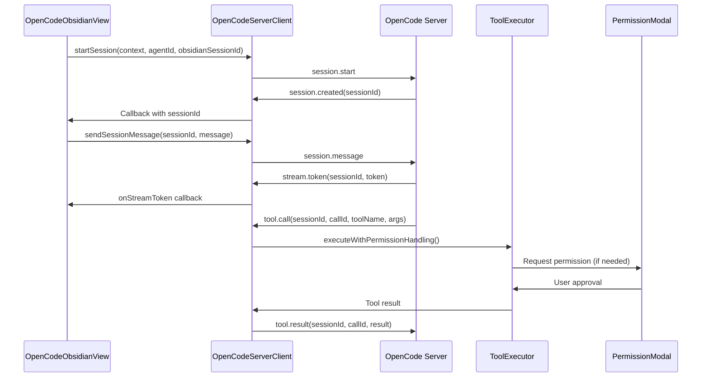
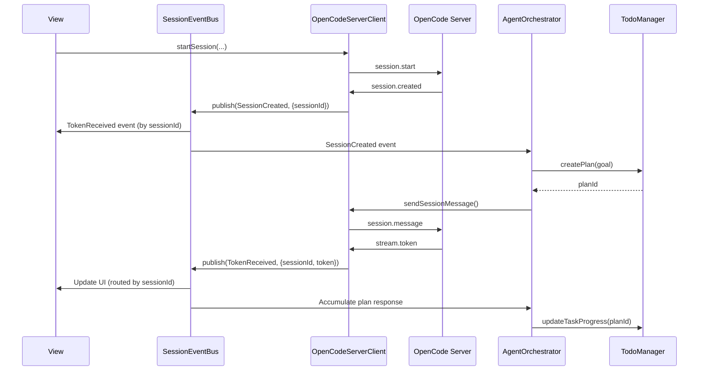

# Architecture Decision Records

This document describes the architecture and key design decisions for the OpenCode Obsidian plugin.

## Table of Contents

-   [Overview](#overview)
-   [Core Architecture](#core-architecture)
-   [OpenCode Server Integration](#opencode-server-integration)
-   [Key Design Decisions](#key-design-decisions)
-   [Module Responsibilities](#module-responsibilities)
-   [Data Flow](#data-flow)
-   [Known Issues and Improvement Plans](#known-issues-and-improvement-plans)

## Overview

The OpenCode Obsidian plugin is built with a modular architecture that separates concerns into distinct modules. The plugin follows TypeScript best practices with strong typing, dependency injection, and clear separation of responsibilities.

## Core Architecture

### Plugin Entry Point

**File**: `src/main.ts`

The `OpenCodeObsidianPlugin` class extends Obsidian's `Plugin` class and serves as the main entry point. It orchestrates:

-   Plugin lifecycle management
-   Settings loading and saving
-   Component initialization (ProviderManager, ConfigLoader, HookRegistry, AgentResolver)
-   View registration
-   Command registration

### Core Modules

#### 1. Provider Management (`src/provider-manager.ts`)

**Responsibility**: Manage AI provider clients and model fetching

-   **ProviderManager**: Centralized management of multiple AI providers
    -   Client initialization and caching
    -   Model fetching with throttling and caching
    -   Provider switching
    -   Factory method for client creation (eliminates duplication)

**Key Features**:

-   LRU-based model list caching (30s duration)
-   Throttling for model fetching (2s minimum interval)
-   Support for built-in providers (Anthropic, OpenAI, Google, ZenMux) and compatible providers

#### 2. AI Client (`src/embedded-ai-client.ts`)

**Responsibility**: Direct interaction with AI provider APIs

-   **EmbeddedAIClient**: Unified client interface for all AI providers
    -   Streaming response handling
    -   Session management with LRU cache
    -   Type-safe event handling for Anthropic SDK
    -   Support for multiple providers via unified interface

**Key Features**:

-   LRU session cache (max 50 sessions, 30min idle timeout)
-   Periodic cleanup of inactive sessions (5min interval)
-   Type-safe Anthropic stream event handling
-   Modular event handlers for maintainability

#### 3. Agent Resolution (`src/agent/agent-resolver.ts`)

**Responsibility**: Resolve and merge agent configurations

-   **AgentResolver**: Encapsulates agent lookup, skill merging, and instruction integration
    -   Agent configuration lookup
    -   Skill merging into prompts
    -   Instruction integration from config loader
    -   Model and tool override handling

**Key Features**:

-   Clean separation of agent resolution logic
-   Skill merging with formatted sections
-   Instruction integration from cached config loader

#### 4. Configuration Loading (`src/config-loader.ts`)

**Responsibility**: Load and parse configuration files from vault

-   **ConfigLoader**: Manages configuration file loading and parsing
    -   Priority-based config file lookup
    -   Agent and skill file loading from `.opencode/` directory
    -   Instruction file loading with glob pattern support
    -   Security validations (file path, size, JSON structure)

**Key Features**:

-   Configuration file priority array (no nested if-else)
-   js-yaml for robust YAML frontmatter parsing
-   File path validation (prevents path traversal)
-   File size limits (config: 1MB, agents/skills: 5MB, instructions: 10MB)
-   JSON structure validation (depth, complexity, string length)

#### 5. Error Handling (`src/utils/error-handler.ts`)

**Responsibility**: Unified error handling across the application

-   **ErrorHandler**: Centralized error handling system
    -   Consistent error logging
    -   User notification with severity levels
    -   Error collection for reporting
    -   Function wrapping for automatic error handling

**Key Features**:

-   Severity levels (Critical, Error, Warning, Info)
-   Context-aware error messages
-   Configurable notification callbacks
-   Optional error collection for debugging

#### 6. Input Validation (`src/utils/validators.ts`)

**Responsibility**: Validate configuration, agent, and provider inputs

-   Comprehensive validation functions for:
    -   OpenCodeConfig
    -   Provider configurations
    -   Agent frontmatter and structures
    -   Skill frontmatter and structures

**Key Features**:

-   Type-safe validation with detailed error messages
-   URL format validation
-   Color hex validation
-   Model format validation
-   Provider ID format validation

#### 7. OpenCode Server Client (`src/opencode-server/client.ts`)

**Responsibility**: HTTP + SSE communication with OpenCode Server runtime

-   **OpenCodeServerClient**: Obsidian wrapper for `@opencode-ai/sdk/client`
    -   Session management (create, get, abort)
    -   Message sending with streaming support
    -   SSE event stream handling with auto-reconnect
    -   Obsidian `requestUrl` API adapter for custom fetch
    -   Event callback system for UI integration

**Key Features**:

-   Based on official `@opencode-ai/sdk/client` SDK
-   Non-blocking `connect()` - starts SSE loop in background
-   Automatic reconnection with exponential backoff
-   Local session caching to reduce server requests
-   Support for both Node.js and SDK event streams
-   Comprehensive error handling with user-friendly messages

**API Methods**:

-   Connection: `connect()`, `disconnect()`, `getConnectionState()`, `isConnected()`
-   Sessions: `createSession()`, `startSession()`, `ensureSession()`, `abortSession()`
-   Messages: `sendMessage()`, `sendSessionMessage()`
-   Events: `onStreamToken()`, `onStreamThinking()`, `onError()`, `onProgressUpdate()`, `onSessionEnd()`
-   Health: `healthCheck()`

**See Also**: `docs/CLIENT.md` for detailed usage and API documentation

#### 8. Agent Orchestrator (`src/orchestrator/agent-orchestrator.ts`)

**Responsibility**: Manage Agent Loop state machine

-   **AgentOrchestrator**: Coordinates task planning and execution
    -   State machine: Planning → Executing → Validating → Retrying → Completed
    -   Context retrieval for planning and execution
    -   Step execution tracking
    -   Retry logic with configurable attempts

**Current State**:

-   ⚠️ **Known Issue**: Currently a placeholder implementation
    -   Does not wait for server responses before completing steps
    -   Needs event-driven state machine integration
    -   Should consume SessionEventBus events to advance states

**Future Architecture**:

-   Will subscribe to SessionEventBus for server events
-   State transitions driven by domain events
-   Unified TaskPlan source with TodoManager

#### 9. Task/TODO Management (`src/todo/todo-manager.ts`)

**Responsibility**: Extract and manage TODOs from conversations, task planning

-   **TodoManager**: Manages TODO extraction and task plans
    -   Extracts TODOs from conversation messages
    -   Creates and manages TaskPlan structures
    -   Task progress tracking and checkpoint management
    -   Persistence to vault storage

**Key Features**:

-   Automatic TODO extraction from messages
-   Task plan creation and parsing from LLM output
-   Step result tracking
-   Checkpoint support for rollback capability
-   Auto-save to `.opencode/todos` directory

**Current Issue**:

-   ⚠️ **Known Issue**: Parallel implementation with AgentOrchestrator
    -   Both maintain TaskPlan concepts independently
    -   Should be unified source of truth for plans
    -   Orchestrator should use TodoManager for plan persistence

#### 10. Context Management (`src/context/context-manager.ts`)

**Responsibility**: Context retrieval, token estimation, and budget allocation

-   **ContextManager**: Manages conversation context
    -   Token estimation for input/output
    -   Context retrieval using RetrievalStrategy
    -   Budget allocation for context tokens
    -   Preemptive compaction when context full

**Key Features**:

-   Multiple retrieval strategies (VaultRetrievalStrategy)
-   Priority-based context selection
-   Budget allocation for token limits
-   Integration with ContextBudgetAllocator

**Current Issue**:

-   ⚠️ **Known Issue**: Context fusion strategy coupled with Orchestrator
    -   Orchestrator directly concatenates retrieved contexts into prompts
    -   Should be extracted into ContextFusionStrategy interface
    -   Enables pluggable strategies (simple concatenation, structured templates, server-side RAG)

## OpenCode Server Integration

The plugin integrates with OpenCode Server via HTTP + SSE for agent orchestration and tool execution.

### Architecture Overview

```
┌─────────────────────┐      HTTP + SSE         ┌──────────────────┐
│  Obsidian Plugin    │ <────────────────────────> │  OpenCode Server │
│  (Client)           │   API Requests + Events │   (Runtime)      │
└─────────────────────┘                            └──────────────────┘
         │                                                   │
         │                                                   │
    ┌────┴────┐                                    ┌────────┴────────┐
    │  View   │                                    │   Agent Loop    │
    │Session  │                                    │  Tool Execution │
    └─────────┘                                    └─────────────────┘
```

### Communication Flow

1. **Session Start**: View sends `session.start` → Server responds with `session.created`
2. **Message Exchange**: View sends `session.message` → Server streams tokens via `stream.token`
3. **Tool Execution**: Server sends `tool.call` → Plugin executes via ToolExecutor → Returns `tool.result`
4. **Permission Requests**: Server sends `permission.request` → User approves via Modal → Returns `permission.response`
5. **Session End**: Server sends `session.end` when task completes or errors

### Protocol Implementation

**File**: `src/opencode-server/client.ts`

-   HTTP API client for sending messages
-   SSE event handler for receiving streaming updates
-   Type-safe event handling
-   Session ID management

**Current Architecture Issues**:

⚠️ **Issue 1**: View directly binds SSE callbacks

-   `OpenCodeObsidianView` registers callbacks directly on `OpenCodeServerClient`
-   UI layer knows transport protocol details (stream.token, thinking, progress)
-   Makes it difficult to replace protocol or introduce offline mode
-   **Solution**: Introduce SessionEventBus to decouple UI from transport layer

⚠️ **Issue 2**: Concurrent session callbacks conflict

-   `startSession()` uses array for callbacks, causing race conditions
-   Multiple concurrent `startSession()` calls may receive wrong `sessionId`
-   Timeout cleanup not properly handled, causing memory leaks
-   **Solution**: Use `Map<obsidianSessionId, PendingRequest>` for request tracking

⚠️ **Issue 3**: Stream callbacks ignore sessionId

-   All stream callbacks use `activeConv` instead of checking `sessionId`
-   Multi-session scenarios cause messages to be written to wrong conversation
-   **Solution**: Route messages by `sessionId` using `findConversationBySessionId()`

### Connection Management

**Current State**:

-   Connection initialized in `main.ts` plugin initialization
-   View's `onOpen()` also checks and connects if needed
-   No unified connection state management

**Planned Improvement**:

-   Create `ConnectionManager` to centralize connection lifecycle
-   Plugin manages connection, View only displays state
-   Clear separation of concerns

## Key Design Decisions

### ADR-1: Unified Error Handling System

**Decision**: Implement a centralized ErrorHandler class instead of scattered console.error calls

**Rationale**:

-   Consistent error reporting across the application
-   Easier to change error handling behavior globally
-   Better user experience with contextual error messages
-   Enables error collection for debugging

**Implementation**: `src/utils/error-handler.ts`

### ADR-2: Agent Resolution Extraction

**Decision**: Extract agent resolution logic into a separate AgentResolver class

**Rationale**:

-   Removed 51 lines of nested logic from main.ts
-   Improved testability (unit tests added)
-   Clear separation of concerns
-   Easier to extend with new agent features

**Implementation**: `src/agent/agent-resolver.ts`

### ADR-3: Provider Client Factory Method

**Decision**: Create a centralized `createProviderClient` factory method in ProviderManager

**Rationale**:

-   Eliminated 8 instances of duplicate EmbeddedAIClient creation code
-   Single source of truth for client creation
-   Easier to maintain and extend
-   Consistent error handling

**Implementation**: `src/provider-manager.ts`

### ADR-4: LRU Session Cache

**Decision**: Implement LRU cache for session management instead of using external library

**Rationale**:

-   Lightweight solution for simple requirements
-   No external dependencies (important for Obsidian plugin size)
-   O(1) access and update operations
-   Sufficient for session management use case

**Implementation**: `src/embedded-ai-client.ts`

### ADR-5: Incremental DOM Updates

**Decision**: Replace full re-renders with incremental DOM updates

**Rationale**:

-   Better performance (reduces unnecessary DOM operations)
-   Smoother user experience
-   Only update changed parts of UI
-   Reduces flickering and layout shifts

**Implementation**: `src/opencode-obsidian-view.ts`

### ADR-6: Debounce and Throttle Utilities

**Decision**: Implement custom debounce/throttle utilities instead of using lodash

**Rationale**:

-   No external dependencies
-   TypeScript-native with proper typing
-   Supports both sync and async functions
-   Sufficient for use cases (input field saving, model fetching)

**Implementation**: `src/utils/debounce-throttle.ts`

### ADR-7: js-yaml Library

**Decision**: Use js-yaml library instead of custom YAML parser

**Rationale**:

-   Supports full YAML 1.1 specification
-   Better error handling
-   Handles complex nested structures
-   Security: safe by default (prevents code execution)

**Implementation**: `src/config-loader.ts`

### ADR-8: Configuration Constants File

**Decision**: Extract all magic numbers to a central constants file

**Rationale**:

-   Single source of truth for configuration values
-   Easier to adjust thresholds and limits
-   Self-documenting code
-   Better maintainability

**Implementation**: `src/utils/constants.ts`

### ADR-9: Security Validations

**Decision**: Add comprehensive security validations for file loading

**Rationale**:

-   Prevents path traversal attacks
-   Prevents DoS attacks via large files
-   Prevents DoS attacks via deep JSON structures
-   Protects user data and system resources

**Implementation**: `src/config-loader.ts` with validations

### ADR-10: Type-Safe Event Handling

**Decision**: Define explicit types for Anthropic SDK events instead of using `any`

**Rationale**:

-   Better IDE support and autocomplete
-   Catch type errors at compile time
-   Self-documenting code
-   Easier refactoring

**Implementation**: `src/embedded-ai-client.ts` with `AnthropicEventTypes` namespace

### ADR-11: HTTP + SSE Protocol for OpenCode Server

**Decision**: Use HTTP + SSE for OpenCode Server communication

**Rationale**:

-   Real-time bidirectional communication required for agent orchestration
-   HTTP API for client-to-server (session/message operations)
-   SSE for server-to-client streaming (tokens, thinking, status)
-   Enables tool call coordination and permission requests
-   Better browser compatibility than WebSocket

**Implementation**: `src/opencode-server/client.ts`

**Status**: ✅ Implemented, but needs improvements (see Known Issues)

### ADR-12: Permission System for Tool Execution

**Decision**: Implement permission-based tool execution with user approval for write operations

**Rationale**:

-   Security: Prevents unauthorized file modifications
-   User control: Users can review changes before applying
-   Audit trail: All tool operations are logged
-   Flexibility: Supports read-only, scoped-write, and full-write modes

**Implementation**: `src/tools/obsidian/permission-manager.ts`, `tool-executor.ts`

**Status**: ✅ Implemented, but preview generation bypasses permission checks (see Known Issues)

### ADR-13: Agent Orchestrator State Machine

**Decision**: Implement state machine for agent task orchestration (Planning → Executing → Validating)

**Rationale**:

-   Clear task execution flow
-   Supports retry logic
-   Enables progress tracking
-   Separates concerns (planning vs execution)

**Implementation**: `src/orchestrator/agent-orchestrator.ts`

**Status**: ⚠️ Partial implementation - currently placeholder, needs event-driven integration

## Module Responsibilities

### Main Plugin (`src/main.ts`)

-   Plugin lifecycle (onload, onunload)
-   Settings management
-   Component orchestration
-   Command registration

### View Component (`src/opencode-obsidian-view.ts`)

-   UI rendering and updates
-   User interaction handling
-   Conversation management
-   Incremental DOM updates

### OpenCode Server Client (`src/opencode-server/client.ts`)

-   HTTP + SSE communication with OpenCode Server using `@opencode-ai/sdk/client`
-   Session lifecycle management (start, message, abort)
-   Stream token/thinking/progress handling via SSE
-   Tool call coordination with Obsidian tools
-   Permission modal integration for write operations

### Agent Orchestrator (`src/orchestrator/agent-orchestrator.ts`)

-   Agent loop state machine (Planning → Executing → Validating → Retrying → Completed)
-   Task planning and execution coordination
-   Context retrieval for planning and execution
-   Step execution tracking and retry logic
-   Integration with TodoManager for task persistence

### Agent Resolver (`src/agent/agent-resolver.ts`)

-   Agent lookup and resolution
-   Skill merging into system prompts
-   Instruction integration
-   Model/tool override handling

### Config Loader (`src/config-loader.ts`)

-   Configuration file loading with security validations
-   Agent/skill file parsing from `.opencode/` directory
-   Instruction file loading with glob pattern support
-   File path validation and size limits

### Error Handler (`src/utils/error-handler.ts`)

-   Unified error handling with severity levels
-   User notifications with context-aware messages
-   Error collection for debugging
-   Function wrapping for automatic error handling

### Validators (`src/utils/validators.ts`)

-   Type-safe input validation for configs, agents, providers
-   URL format validation and security checks
-   Color hex validation and model format validation
-   Provider ID format validation

### Constants (`src/utils/constants.ts`)

-   Configuration constants and threshold values
-   Size limits and time intervals
-   Centralized configuration for maintainability

### Hooks (`src/hooks/`)

-   Hook registration and execution system
-   Event-driven architecture for extensibility
-   Plugin lifecycle event handling

### Context Management (`src/context/`)

-   Token estimation (`token-estimator.ts`)
-   Context retrieval with strategies (`retrieval-strategy.ts`)
-   Budget allocation for context tokens (`context-budget-allocator.ts`)
-   Context compaction (`compaction-manager.ts`)
-   Preemptive compaction when context full
-   Full threshold detection and management

### Session Management (`src/session/`)

-   Session storage and persistence (`session-storage.ts`)
-   Session auto-save mechanism (`session-manager.ts`)
-   Session cleanup and TTL management
-   Conversation state management

### Task Management (`src/todo/`)

-   Task planning and orchestration (`todo-manager.ts`)
-   Task extraction from conversation messages (`todo-extractor.ts`)
-   Step result tracking and checkpoints
-   Task progress calculation and monitoring
-   Persistence to `.opencode/todos` directory
-   Integration with agent orchestrator for execution

### MCP Integration (`src/mcp/`)

-   Model Context Protocol server management (`mcp-manager.ts`)
-   MCP tool and resource integration
-   Dynamic tool registration from MCP servers
-   Unified permission management for MCP tools
-   Stdio transport support for MCP servers

### Obsidian Tool System (`src/tools/obsidian/`)

-   Tool definitions and schemas (Zod validation)
-   Tool execution with permission checks
-   Audit logging for all tool operations
-   Permission management (read-only, scoped-write, full-write)
-   Tool registry and routing for both core and MCP tools

-   Tool definitions and schemas (Zod validation)
-   Tool execution with permission checks
-   Audit logging for all tool operations
-   Permission management (read-only, scoped-write, full-write)
-   Tool registry and routing

**Available Tools (6 core tools)**:

1. `obsidian.search_vault` - Search notes in vault (read-only)
2. `obsidian.read_note` - Read note content (read-only)
3. `obsidian.list_notes` - List notes in folder (read-only)
4. `obsidian.get_note_metadata` - Get note metadata including frontmatter, tags, links (read-only)
5. `obsidian.create_note` - Create new note (scoped-write)
6. `obsidian.update_note` - Update note content with multiple modes (scoped-write)
    - `replace`: Replace entire content
    - `append`: Append to end
    - `prepend`: Prepend to beginning
    - `insert`: Insert at line number or marker

**Permission System**:

-   Read-only operations: No approval required
-   Scoped-write operations: Require user approval via PermissionModal
-   Permission scopes: Allowed/denied paths, file size limits, extension filters
-   Audit logging: All tool executions are logged with timestamps and metadata

## Data Flow

### OpenCode Server Message Flow (Current)



**Issues with Current Flow**:

-   ⚠️ Direct callback binding (no event bus)
-   ⚠️ No sessionId validation in stream callbacks
-   ⚠️ Concurrent session requests can conflict

### Planned Event-Driven Flow (Future)



### Message Sending Flow (Embedded AI - Legacy)

1. User types message in view
2. View calls `plugin.sendPrompt()`
3. `sendPrompt()` uses `AgentResolver` to resolve agent config
4. `AgentResolver`:
    - Looks up agent by ID
    - Merges skills into system prompt
    - Merges instructions from config loader
    - Returns resolved config
5. `sendPrompt()` calls `ProviderManager.sendPrompt()`
6. `ProviderManager` gets or creates client for provider
7. `EmbeddedAIClient.sendPrompt()`:
    - Creates or retrieves session (LRU cache)
    - Sends request to AI provider API
    - Streams responses back
    - Handles events with type-safe handlers
8. View receives chunks and updates UI incrementally
9. Hooks are executed at various points for extensibility

### Configuration Loading Flow

1. Plugin loads settings from Obsidian
2. If `.opencode/` directory exists:
    - `ConfigLoader.loadConfig()` loads config.json (with priority lookup)
    - `ConfigLoader.loadAgents()` loads agent files from `.opencode/agent/`
    - `ConfigLoader.loadSkills()` loads skill files from `.opencode/skill/`
    - `ConfigLoader.loadInstructions()` loads instruction files (supports glob patterns)
3. All loaded data is validated using validators
4. Data is stored in plugin settings and used by AgentResolver

### Error Handling Flow

1. Error occurs in any module
2. Module calls `ErrorHandler.handleError()` with:
    - Error instance
    - Context (module, function, operation, metadata)
    - Severity level
3. ErrorHandler:
    - Logs to console (if enabled)
    - Collects error (if enabled)
    - Shows user notification (if enabled and severity warrants)
4. Error is handled gracefully, user sees friendly message

## Tool System

### Tool Execution Flow

1. OpenCode Server sends tool call request via HTTP API
2. `OpenCodeServerClient` receives SSE event and calls `ObsidianToolRegistry`
3. `ObsidianToolRegistry` validates input schema and routes to `ObsidianToolExecutor`
4. `ObsidianToolExecutor` executes tool operation:
    - Checks permissions using `PermissionManager.canRead()` / `canWrite()`
    - Performs operation (read/write/create/update)
    - Records audit log via `AuditLogger`
    - Returns result or throws `PermissionPendingError` if approval needed
5. If approval required:
    - `generatePreview()` called (currently in `OpenCodeServerClient` - ⚠️ bypasses permissions)
    - `PermissionModal` is shown to user with preview
    - User approves or denies operation
6. Result sent back to OpenCode Server via HTTP API

**Current Issues**:

-   ⚠️ Preview generation (`generatePreview`) in `OpenCodeServerClient` directly reads files, bypassing `PermissionManager`
-   ⚠️ Preview and execution use different code paths, inconsistent permission checks

**Planned Improvement**:

-   Move `generatePreview()` to `ObsidianToolExecutor`
-   Unified permission check path for both preview and execution
-   Consistent audit logging for preview operations

### Permission Model

**Permission Levels**:

-   `read-only`: Can only read vault files
-   `scoped-write`: Can write to specific paths (requires approval)
-   `full-write`: Can write anywhere (requires approval)

**Permission Scope**:

-   `allowedPaths`: Glob patterns for allowed file paths
-   `deniedPaths`: Glob patterns for denied file paths (checked first)
-   `maxFileSize`: Maximum file size in bytes
-   `allowedExtensions`: List of allowed file extensions

**Update Note Tool**:
The `update_note` tool supports four update modes for markdown editing:

-   `replace`: Completely replace file content (useful for full rewrites)
-   `append`: Add content to end of file (useful for logging, notes)
-   `prepend`: Add content to beginning of file (useful for headers, metadata)
-   `insert`: Insert at specific line number or after marker string (most precise control)

All write operations default to `dryRun=true` to show preview before applying.

## Testing Strategy

-   **Unit Tests**: Core business logic (ErrorHandler, AgentResolver, ToolExecutor, PermissionManager) - using Vitest
-   **Integration Tests**: Configuration loading and validation, tool execution flow
-   **E2E Tests**: Not implemented (would require Obsidian environment)

## Known Issues and Improvement Plans

### Critical Issues (Recently Addressed)

#### 1. HTTP Client SDK Migration ✅ COMPLETED

**Issue**: Custom HTTP client implementation with scattered fetch calls and inconsistent error handling.

**Solution**: Migrated to `@opencode-ai/sdk/client` for standardized API interactions.

-   Unified HTTP client wrapper with consistent error handling
-   Standardized request/response patterns
-   Improved type safety and maintainability

**Files**: `src/opencode-server/client.ts`

#### 2. Task Orchestration Enhancement ✅ COMPLETED

**Issue**: TodoManager was only a data storage system without orchestration capabilities.

**Solution**: Upgraded to full task orchestration system.

-   Task planning and execution tracking
-   Progress monitoring and checkpoint support
-   Integration with agent loop state machine

**Files**: `src/todo/todo-manager.ts`, `src/orchestrator/agent-orchestrator.ts`

#### 3. MCP Integration ✅ COMPLETED

**Issue**: MCP integration was placeholder implementation.

**Solution**: Implemented complete Model Context Protocol support.

-   MCP server initialization and management
-   Dynamic tool registration from MCP servers
-   Resource management and unified permissions

**Files**: `src/mcp/mcp-manager.ts`, `src/tools/obsidian/tool-registry.ts`

### Architecture Improvements (Medium Priority)

#### 4. Session/Event Bus for Decoupling

**Issue**: View directly binds SSE callbacks, UI knows transport protocol details.

**Impact**: Difficult to replace protocol or introduce offline mode.

**Solution**:

-   Create `SessionEventBus` class (`src/session/session-event-bus.ts`)
-   Convert SSE events to domain events (TokenReceived, ToolCallRequested, etc.)
-   View subscribes to domain events, not SSE callbacks
-   Enables protocol abstraction and offline mode support

**Files**: New `src/session/session-event-bus.ts`, `src/opencode-server/client.ts`, `src/opencode-obsidian-view.ts`

#### 5. Context Fusion Strategy Extraction

**Issue**: Context fusion strategy coupled with orchestration logic.

**Impact**: Hard to change context assembly strategies, limits flexibility.

**Solution**:

-   Create `ContextFusionStrategy` interface
-   Implement strategies: `SimpleConcatenationStrategy`, `StructuredTemplateStrategy`
-   Inject strategy into `ContextManager` or use as separate service
-   Enables pluggable strategies (client-side vs server-side RAG)

**Files**: New `src/context/context-fusion-strategy.ts`, `src/orchestrator/agent-orchestrator.ts`

#### 6. Unified Connection Management

**Issue**: Connection management split between `main.ts` and `OpenCodeObsidianView.onOpen()`.

**Impact**: Unclear ownership, connection state not centrally managed.

**Solution**:

-   Create `ConnectionManager` class
-   Plugin initializes and manages connection lifecycle
-   View only displays state and triggers user actions (connect/disconnect buttons)
-   Expose connection state via events or observable

**Files**: New `src/session/connection-manager.ts`, `src/main.ts`, `src/opencode-obsidian-view.ts`

-   Unified audit logging for both preview and execution

**Files**: `src/tools/obsidian/tool-executor.ts`, `src/opencode-server/client.ts`

#### 8. Unified TaskPlan Source

**Issue**: `TodoManager` and `AgentOrchestrator` both maintain TaskPlan concepts independently.

**Impact**: Duplicate state, plans can get out of sync.

**Solution**:

-   `TodoManager` becomes single source of truth for TaskPlan
-   Orchestrator creates/updates plans via `TodoManager`
-   Orchestrator queries state from `TodoManager`
-   Remove local plan storage from Orchestrator

**Files**: `src/orchestrator/agent-orchestrator.ts`, `src/todo/todo-manager.ts`

#### 9. Context Fusion Strategy Extraction

**Issue**: `AgentOrchestrator` directly concatenates context retrieval results into prompts.

**Impact**: Context fusion strategy coupled with orchestration, hard to change.

**Solution**:

-   Create `ContextFusionStrategy` interface
-   Implement strategies: `SimpleConcatenationStrategy`, `StructuredTemplateStrategy`
-   Inject strategy into `ContextManager` or use as separate service
-   Enables pluggable strategies (client-side vs server-side RAG)

**Files**: New `src/context/context-fusion-strategy.ts`, `src/orchestrator/agent-orchestrator.ts`

#### 10. Unified Connection Management

**Issue**: Connection management split between `main.ts` and `OpenCodeObsidianView.onOpen()`.

**Impact**: Unclear ownership, connection state not centrally managed.

**Solution**:

-   Create `ConnectionManager` class
-   Plugin initializes and manages connection lifecycle
-   View only displays state and triggers user actions (connect/disconnect buttons)
-   Expose connection state via events or observable

**Files**: New `src/session/connection-manager.ts`, `src/main.ts`, `src/opencode-obsidian-view.ts`

### Implementation Roadmap

**Phase 1 (COMPLETED)**: Critical Infrastructure Updates

-   ✅ HTTP Client SDK Migration - Migrated to `@opencode-ai/sdk/client`
-   ✅ Task Orchestration Enhancement - Upgraded TodoManager to full orchestration system
-   ✅ MCP Integration - Implemented complete Model Context Protocol support

**Phase 2 (Current)**: Architecture Refinements

-   SessionEventBus for decoupling UI from transport protocol
-   Context fusion strategy extraction for pluggable strategies
-   Unified connection management across components

**Phase 3 (Future)**: Advanced Features

-   Enhanced caching strategies for context and tool results
-   Performance monitoring and metrics collection
-   Server-side RAG integration for better scalability

## Future Considerations

-   **Event-Driven Architecture**: Complete migration to event bus pattern for better decoupling
-   **Protocol Abstraction**: Support multiple protocols (HTTP/SSE, WebSocket, local inference)
-   **Offline Mode**: Support local LLM inference without server dependency
-   **MCP Ecosystem**: ✅ COMPLETED - Full Model Context Protocol integration for standardized tool access
-   **LSP Integration**: Language Server Protocol integration for enhanced code intelligence
-   **Enhanced Caching**: Multi-level caching for context, models, and tool results
-   **Performance Monitoring**: Metrics collection and performance dashboards
-   **Server-Side RAG**: Move context retrieval to server for better scalability and performance
